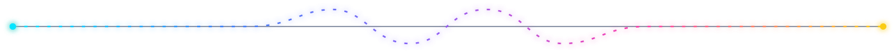
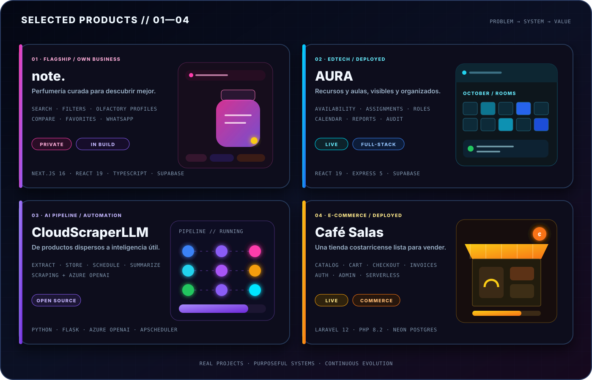
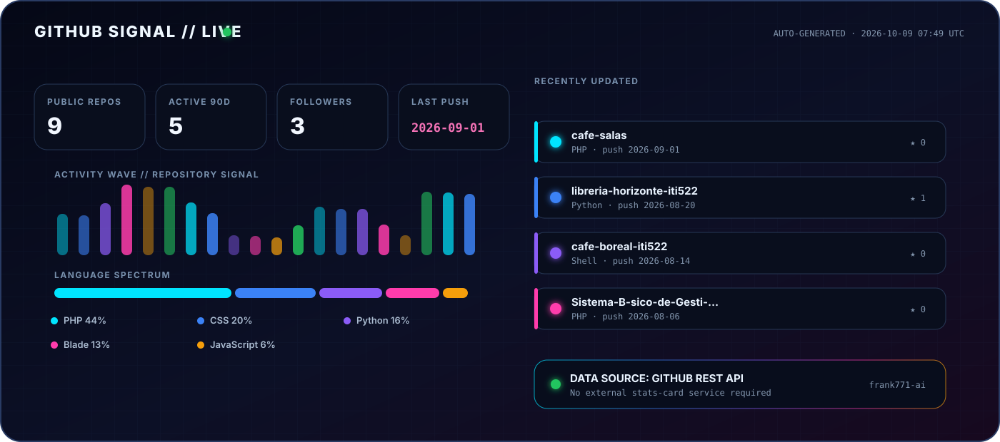
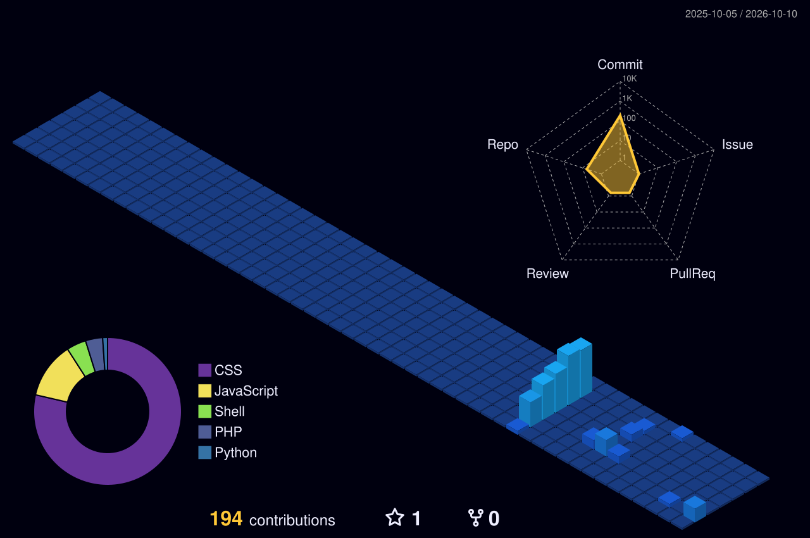

  <picture>
    <source media="(max-width: 680px)" srcset="assets/hero-mobile.svg" />
    
  </picture>

<h3 align="center">Diseño, construyo y despliego productos digitales completos.</h3>

Full-stack · Cloud · Inteligencia artificial · Datos · Automatización

  
  

  
  
  
  

## `> whoami`

Soy **Franklin Castillo Umaña**, estudiante de Ingeniería en Tecnologías de la Información en la **Universidad Técnica Nacional de Costa Rica**. Conecto software, nube, datos e inteligencia artificial para transformar problemas reales en productos desplegados, observables y útiles.

<table>
  <tr>
    <td width="33%" align="center"> Construyendo desde Costa Rica.</td>
    <td width="33%" align="center"> Ingeniería, producto y aprendizaje continuo.</td>
    <td width="33%" align="center"> De la idea al sistema funcionando.</td>
  </tr>
</table>

## 🚀 Productos destacados

  <picture>
    <source media="(max-width: 680px)" srcset="assets/projects-showcase-mobile.svg" />
    
  </picture>

<table>
  <tr>
    <td width="50%" valign="top">
      <h3 align="center">01 · note.</h3>
      

      
<b>Problema:</b> descubrir una fragancia adecuada suele requerir recorrer catálogos desordenados y recibir poca orientación.

      
<b>Construcción:</b> catálogo interactivo con búsqueda, filtros, perfiles olfativos, comparación, favoritos y atención por WhatsApp.

      
<b>Estado:</b> producto privado en desarrollo con Next.js 16, React 19, TypeScript y Supabase.

    </td>
    <td width="50%" valign="top">
      <h3 align="center">02 · AURA</h3>
      

      
<b>Problema:</b> coordinar disponibilidad, asignación y préstamo de aulas sin perder trazabilidad.

      
<b>Construcción:</b> roles, calendario institucional, reportes, auditoría y administración de recursos.

      

    </td>
  </tr>
  <tr>
    <td width="50%" valign="top">
      <h3 align="center">03 · CloudScraperLLM</h3>
      

      
<b>Problema:</b> convertir información dispersa de productos en datos estructurados y resúmenes útiles.

      
<b>Construcción:</b> extracción, persistencia, tareas programadas y generación de resúmenes con Azure OpenAI.

      

    </td>
    <td width="50%" valign="top">
      <h3 align="center">04 · Café Salas</h3>
      

      
<b>Problema:</b> llevar una experiencia comercial completa a una arquitectura web desplegable y administrable.

      
<b>Construcción:</b> catálogo, carrito, checkout, autenticación, facturas PDF, administración y pruebas.

      
 

    </td>
  </tr>
</table>

## ⚡ Capacidades

<table>
  <tr>
    <td width="50%" valign="top"> Interfaces modernas, APIs REST, autenticación y experiencias completas de principio a fin.</td>
    <td width="50%" valign="top"> Contenedores, CI/CD, Kubernetes, despliegues reproducibles y observabilidad.</td>
  </tr>
  <tr>
    <td width="50%" valign="top"> LLMs, agentes, extracción de datos, tareas programadas y flujos inteligentes.</td>
    <td width="50%" valign="top"> Modelado SQL, PostgreSQL, Supabase, MariaDB, SQLite y Cloudflare D1.</td>
  </tr>
</table>

## 🧊 Laboratorio visual 3D

Capas isométricas, núcleo luminoso, escáner y partículas orbitales representan cómo conecto producto, infraestructura, inteligencia y datos.

## 🧬 Ecosistema tecnológico

<b>Lenguajes y frontend</b>

 

  
    
  

<b>Backend, datos y APIs</b>

 

  
    
  
  
  

<b>Cloud, DevOps y observabilidad</b>

 

  
    
  
  
  
  

<b>IA, datos y automatización</b>

 

  
  
  
  
  
  
  
  

## 📡 Señal de actividad

Generado diariamente desde la API de GitHub: repositorios públicos, proyectos activos, lenguajes y últimos cambios sin depender de servicios de tarjetas externas.

## 🏙️ Skyline 3D de contribuciones

  <picture>
    <source media="(prefers-color-scheme: dark)" srcset="./profile-3d-contrib/profile-night-view.svg" />
    <source media="(prefers-color-scheme: light)" srcset="./profile-3d-contrib/profile-green-animate.svg" />
    
  </picture>

Se regenera automáticamente cada día con mi actividad real.

<b>🐍 Activar modo arcade: el código también se mueve</b>

 

  <picture>
    <source media="(prefers-color-scheme: dark)" srcset="https://raw.githubusercontent.com/frank771-ai/frank771-ai/output/github-contribution-grid-snake-dark.svg" />
    <source media="(prefers-color-scheme: light)" srcset="https://raw.githubusercontent.com/frank771-ai/frank771-ai/output/github-contribution-grid-snake.svg" />
    
  </picture>

## 🎯 Ahora mismo

<table>
  <tr>
    <td width="50%" valign="top"> Profundizando en arquitecturas full-stack y cloud-native.</td>
    <td width="50%" valign="top"> Construyendo soluciones con IA aplicada y automatización.</td>
  </tr>
  <tr>
    <td width="50%" valign="top"> Mejorando seguridad, observabilidad y calidad de despliegue.</td>
    <td width="50%" valign="top"> Convirtiendo proyectos académicos en productos demostrables.</td>
  </tr>
</table>

## 🤝 Construyamos algo

  
¿Tienes una idea, un proyecto o una oportunidad de colaboración?

  
  

  
   
  <i>Ideas → sistemas → impacto.</i>

