<div align="center">
  <picture>
    
  </picture>
</div>

<div align="center">
  <a href="https://git.io/typing-svg">
    
  </a>
</div>

<div align="center">
  <a href="mailto:castillofranklin771@gmail.com"></a>
  <a href="https://linkedin.com/in/frank771-ai"></a>
  <a href="https://github.com/frank771-ai?tab=followers"></a>
  
</div>

<br />

## `> whoami`

Soy **Franklin Castillo Umaña**, estudiante de Ingeniería en Tecnologías de la Información en la **Universidad Técnica Nacional de Costa Rica**. Me gusta conectar desarrollo de software, nube, datos, automatización e inteligencia artificial para llevar una idea desde el diagrama hasta una solución desplegada y observable.

- 🔭 Construyo aplicaciones **full-stack**, APIs, automatizaciones y soluciones cloud.
- 🧠 Exploro **IA generativa, LLMs, scraping inteligente y análisis de datos**.
- ☁️ Trabajo con despliegues reproducibles, contenedores, bases de datos y observabilidad.
- 🛡️ Me interesan las arquitecturas seguras, el control de acceso y la ingeniería confiable.
- 📍 San Carlos, Costa Rica.

<div align="center">
  
</div>

## ⚡ Lo que construyo

<table>
  <tr>
    <td width="25%" align="center"><b>🌐 Full-Stack</b><br /><sub>Interfaces modernas, APIs REST, autenticación y experiencias completas.</sub></td>
    <td width="25%" align="center"><b>☁️ Cloud & DevOps</b><br /><sub>Contenedores, CI/CD, Kubernetes, despliegues y observabilidad.</sub></td>
    <td width="25%" align="center"><b>🤖 IA & Automation</b><br /><sub>LLMs, extracción de datos, tareas programadas y flujos inteligentes.</sub></td>
    <td width="25%" align="center"><b>🗄️ Data</b><br /><sub>Modelado SQL, PostgreSQL, Supabase, MariaDB, SQLite y D1.</sub></td>
  </tr>
</table>

## 🧬 Ecosistema tecnológico

<details open>
<summary><b>Lenguajes y frontend</b></summary>
<br />
<div align="center">
  
  <br /><br />
  
</div>
</details>

<details open>
<summary><b>Backend, datos y APIs</b></summary>
<br />
<div align="center">
  
  <br /><br />
  
  
  
  
</div>
</details>

<details open>
<summary><b>Cloud, DevOps y observabilidad</b></summary>
<br />
<div align="center">
  
  <br /><br />
  
  
  
  
</div>
</details>

<details open>
<summary><b>IA, datos y automatización</b></summary>
<br />
<div align="center">
  
  
  
  
  
  
  
  
</div>
</details>

## 🚀 Proyectos destacados

<table>
  <tr>
    <td width="50%" valign="top">
      <h3 align="center">AURA</h3>
      <p align="center"><b>Administración Universitaria de Recursos y Aulas</b></p>
      <p>Sistema full-stack para disponibilidad, asignación y préstamo de aulas, con roles, calendario institucional, reportes y auditoría.</p>
      <p align="center">
        
        
        
      </p>
      <p align="center"><a href="https://aura-utn.vercel.app/"><b>▶ Abrir demo</b></a></p>
    </td>
    <td width="50%" valign="top">
      <h3 align="center">CloudScraperLLM</h3>
      <p align="center"><b>Scraping, análisis e inteligencia artificial</b></p>
      <p>Pipeline que extrae productos, guarda información, programa ejecuciones y genera resúmenes con Azure OpenAI.</p>
      <p align="center">
        
        
        
      </p>
      <p align="center"><a href="https://github.com/frank771-ai/CloudScraperLLM"><b>⌁ Ver repositorio</b></a></p>
    </td>
  </tr>
  <tr>
    <td width="50%" valign="top">
      <h3 align="center">Café Salas</h3>
      <p align="center"><b>E-commerce costarricense</b></p>
      <p>Tienda virtual completa con catálogo, carrito, checkout, autenticación, facturas PDF, administración, pruebas y despliegue serverless.</p>
      <p align="center">
        
        
        
      </p>
      <p align="center"><a href="https://github.com/frank771-ai/cafe-salas"><b>⌁ Ver repositorio</b></a> · <a href="https://cafe-salas.vercel.app"><b>▶ Demo</b></a></p>
    </td>
    <td width="50%" valign="top">
      <h3 align="center">Librería Horizonte</h3>
      <p align="center"><b>Inventario cloud reproducible</b></p>
      <p>Aplicación de inventario con FastAPI y PostgreSQL, preparada con health checks, persistencia y orquestación mediante Docker Compose.</p>
      <p align="center">
        
        
        
      </p>
      <p align="center"><a href="https://github.com/frank771-ai/libreria-horizonte-iti522"><b>⌁ Ver repositorio</b></a></p>
    </td>
  </tr>
</table>

## 📊 Señal en vivo

<div align="center">
  
  
</div>

<div align="center">
  
</div>

<div align="center">
  
</div>

<details>
<summary><b>📈 Abrir más métricas dinámicas</b></summary>
<br />
<div align="center">
  
  
</div>
</details>

## 🐍 El código también se mueve

<div align="center">
  <picture>
    <source media="(prefers-color-scheme: dark)" srcset="https://raw.githubusercontent.com/frank771-ai/frank771-ai/output/github-contribution-grid-snake-dark.svg" />
    <source media="(prefers-color-scheme: light)" srcset="https://raw.githubusercontent.com/frank771-ai/frank771-ai/output/github-contribution-grid-snake.svg" />
    
  </picture>
</div>

## 🎯 Ahora mismo

```text
01. Profundizando en arquitecturas full-stack y cloud-native
02. Construyendo soluciones con IA aplicada y automatización
03. Mejorando seguridad, observabilidad y calidad de despliegue
04. Convirtiendo proyectos académicos en productos demostrables
```

## 🤝 Conectemos

<div align="center">
  <p>¿Tienes una idea, un proyecto o una oportunidad de colaboración?</p>
  <a href="mailto:castillofranklin771@gmail.com"></a>
  <a href="https://linkedin.com/in/frank771-ai"></a>
</div>

<div align="center">
  
  <br />
  <sub><i>Construyendo el futuro, un commit a la vez.</i></sub>
</div>
